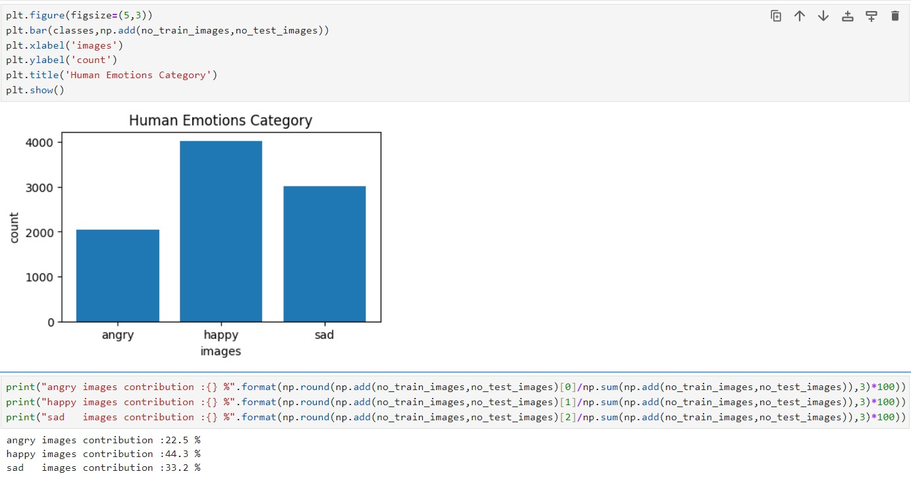

# Human-Emotions-Detection-Transformers
Human emotions detection using transformers to detect and classify emotions from images. 

## Table of Contents
- [Project Overview](#project-overview)
- [Data Sources](#data-sources)
- [Why Transformers choosen over convolution neural networks](#why-transformers-over-cnn)
- [EDA](#exploratory-data-analysis)
- [Assumptions](#assumptions)
- [Machine learning model](#machine-learning-model)
  - [Vision Transformer from scratch](#custom-vit-model)
  - [Using pretrained hugging face model](#hugging-face-pre-trained-model)
- [Loss function](#loss-function)
- [Making Predictions](#making-predictions)
- [Deployee model](#deployee-model)

## Project Overview
  
  The goal of this project is to build a model using vision transformers that detects human emotions (e.g., happiness, sadness, anger etc ) from images, each image is of different dimentions.

## Data Sources 
  Downloaded dataset from kaggle and its is organized into subfolders for each emotion
   - Train Folder:
      -  angry
      -  happy
      -  sad
  -  Test Folder:
      -  angry
      -  appy
      -  sad

## Why Transformers over CNN

Convolution Nueral Network                                                                 |             Transformers                                                                                                             | 
-----------------------------------------------------------------------------------------  | ----------------------------------------------------------------------------------------------------------------------------         | 
Using convolutional layers to capture local patterns in data edges & textures etc          |   Transformers don't use convolutional or pooling operations instead, they rely on fully connected layers and attention mechanisms. | 
max-pooling - reduce dimentionality of data flattened   - fed data into fully connected layers for classification or regression tasks.|Attention allows models to dynamically focus on pertinent parts of the input data.                                        
smaller dataset.                                                                            |   Larger datasets.                                                                                                                 | 

## Exploratory Data Analysis

## Assumptions
1. Vision Transformers need powerful hardware (GPUs, TPUs) for training on large datasets. Due to limitations on my local machine, I'm using pre-trained models from Hugging Face and fine-tuning them for my project.
2. Instead of processing entire images, the image is divided into fixed-size patches. visual transformations can be effectively represented by patches of size (16 x 16).

## Machine learning model
   ## custom vit model
   - [**Code for Vision Transformer scratch **](VITModel.ipynb)
     
   ## hugging face pre trained model
   - [**Using Hugging Face pre trained model **](Pretrained_HuggingFaceModel.ipynb)
    
## Loss function
used categorical crossentropy as loss function

## Making predictions

## Deployee model
Deployee the model into my local machine using fastAPI.

[**source code**](/deployement/api.py)

Test Model using FastAPI swagger url.

input : uploaded an human face angry image to 

Results:

 

